Perfect 👍 I’ll break this into two main flows with step-by-step explanations, covering **VC Issuance Plugin Path** and **Data Provider Plugin Path with QR Code + Pixel Pass Flow**.

---

# 🔐 VC Issuance Flow – Detailed Explanation

## 1. **Client Initiates Issuance**

* The **Client** (e.g., wallet or app) sends a request to the **Credential API** to issue a Verifiable Credential (VC).
* The request follows the **OIDC4VCI (OpenID Connect for Verifiable Credential Issuance)** standard.

---

## 2. **Two Paths of Issuance**

### **A. Using VC Issuance Plugin**

1. **Forwarding Request**

   * The **Credential API** forwards the issuance request to the **VC Issuance Plugin**.

2. **Delegation to Data Provider Plugin**

   * The **VC Issuance Plugin** communicates with the **Data Provider Plugin** to fetch user data, create the VC, and sign it.

3. **Return Signed VC**

   * The **Data Provider Plugin** returns the complete signed VC to the **VC Issuance Plugin**.
   * The **VC Issuance Plugin** then forwards it back to the **Credential API**, which finally returns it to the **Client**.

✅ This path is “plugin-driven,” meaning most of the logic is encapsulated in the VC Issuance Plugin.

---

### **B. Using Data Provider Plugin (Detailed Flow with QR Code Integration)**

This is the extended flow where templating, QR code generation, and Pixel Pass signing come into play.

#### **Step 1: Data Retrieval**

* The **Credential API** requests the required data from the **Data Provider Plugin**.
* The **Data Provider Plugin** returns **raw data** (e.g., name, DOB, ID number).

#### **Step 2: Fetch Credential Template**

* The **Credential API** fetches a **Credential Template** from the **Credential Configuration**.
* This template defines the VC structure and now includes a **qrCode field**.

#### **Step 3: Apply Template with Velocity**

* The **Credential API** sends the raw data + template to the **Velocity Templating Engine**.
* The engine produces a **VC JSON** where:

  * All standard credential fields are populated.
  * A **qrCode field** exists, listing the fields that must be encoded in the QR code (e.g., `fullName`, `dateOfBirth`, `uniqueIdNumber`).

#### **Step 4: Extract & Encode QR Code**

* The **Credential API** extracts the defined fields from the `qrCode` section.
* These fields are sent to the **Pixel Pass Service**, which generates an **encoded QR code payload**.

#### **Step 5: Sign QR Code (CWT)**

* The encoded QR data is passed to the **Key Manager**.
* The Key Manager uses its `cwtSign` method to sign the QR payload, producing a **CWT (CBOR Web Token)**.

#### **Step 6: Insert QR Code into VC JSON**

* The signed QR CWT is added into the `qrCode` field of the **VC JSON**.

#### **Step 7: AddProof to Sign the Full VC**

* The **Credential API** sends the VC JSON (with signed QR CWT) to the **Credential Service**.
* The Credential Service applies the **addProof** method, producing a fully signed Verifiable Credential (according to W3C/JSON-LD, JWT, or other required proof formats).

#### **Step 8: Return Final VC**

* The **Credential API** returns the **final signed VC** to the **Client** over the OIDC4VCI flow.

---

# ✨ Key Points in the Extended Flow

* **qrCode Field in Template**: Acts as a mapping definition for which fields should be included in the QR code.
* **Pixel Pass Service**: Encodes sensitive fields into a compact QR payload.
* **Key Manager**: Ensures cryptographic integrity of the QR code by signing it with CWT.
* **Credential Service (AddProof)**: Signs the entire VC, ensuring compliance with Verifiable Credential standards.

---

👉 Would you like me to also **create a tabular step-by-step comparison** (VC Issuance Plugin Path vs. Data Provider Plugin Path with QR code), so it’s easier to see the differences side by side?

## STEPS:

```mermaid
    sequenceDiagram
        participant Client as 🌐 Client
        box Inji Certify #E6F3FF
        participant CredentialAPI as 🔗 Credential API
        participant Credential as 🔐 Credential
        participant VelocityTemplatingEngine as ⚙️ Velocity Templating Engine
        participant CredentialConfiguration as ⚙️ Credential Configuration
        end
        participant VCIssuancePlugin as 🔌 VC Issuance Plugin
        participant DataProviderPlugin as 🔌 Data Provider Plugin
        participant PixelPass as 🧩 Pixel Pass Service
        participant KeyManager as 🔑 Key Manager

        Client->>CredentialAPI: Request VC Issuance (OIDC4VCI)
        alt Using VC Issuance Plugin
            CredentialAPI->>VCIssuancePlugin: Forward request
            VCIssuancePlugin->>DataProviderPlugin: get data, create VC, sign VC
            DataProviderPlugin-->>VCIssuancePlugin: Return complete signed VC
            VCIssuancePlugin-->>CredentialAPI: Return complete signed VC
            
        else Using Data Provider Plugin
            CredentialAPI->>DataProviderPlugin: Request data
            DataProviderPlugin-->>CredentialAPI: Return raw data
            
            CredentialAPI->>CredentialConfiguration: Fetch credential template
            CredentialConfiguration-->>CredentialAPI: Return template
            
            CredentialAPI->>VelocityTemplatingEngine: Format raw data with template
            VelocityTemplatingEngine-->>CredentialAPI: Return unsigned credential JSON (includes qrCode field with mapping info)
            
            Note right of CredentialAPI: qrCode field defines fields like fullName,<br/>dateOfBirth, uniqueIdNumber
            
            CredentialAPI->>PixelPass: Send mapped qrCode fields
            PixelPass-->>CredentialAPI: Return encoded QR code data
            
            CredentialAPI->>KeyManager: cwtSign(encoded QR code)
            KeyManager-->>CredentialAPI: Return signed QR code CWT
            
            CredentialAPI->>CredentialAPI: Add signed QR code CWT into VC JSON (qrCode field)
            
            CredentialAPI->>Credential: AddProof(VC JSON with qrCode CWT)
            Credential-->>CredentialAPI: Return fully signed VC
            
        end
        CredentialAPI-->>Client: Return final VC (OIDC4VCI)
```

